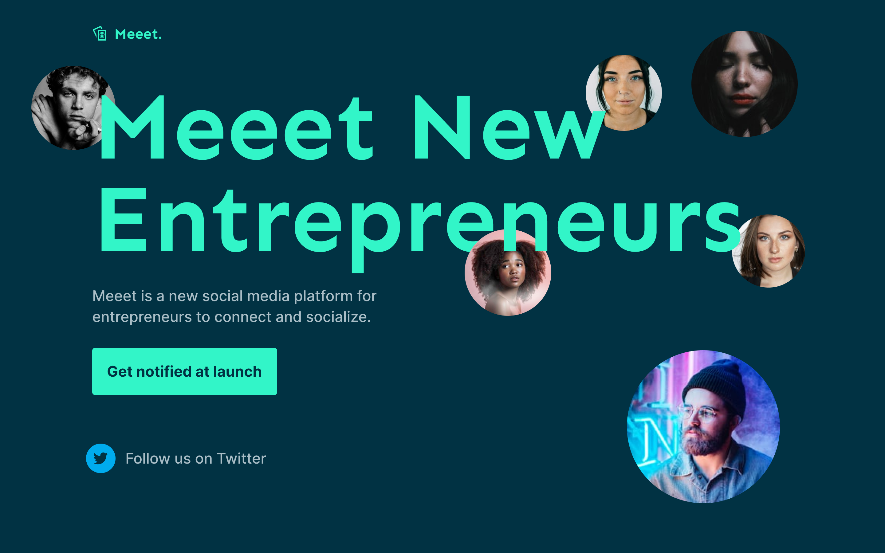

# Codwell - Meeet Waitlist Template

This is a solution to the [Meeet Waitlist challenge on Codewell.cc](https://www.codewell.cc/challenges/meeet-waitlist-template--60e05defa383e41090a3c273). Frontend Mentor challenges help you improve your coding skills by building realistic projects. 

## Overview

### The challenge

Users should be able to:

- View the optimal layout for the site depending on their device's screen size

### Screenshot

### Links

- Solution URL: [Solution URL](https://www.codewell.cc/challenges/web-developer-portfolio--617d4897a383e41090a3e46f/solution/61da90b26da8ba3fac6b00dd)
- Live Site URL: [Live Site URL](https://codwell-webdeveloper-challenge.netlify.app/)

### Built with
- SASS
- Flexbox
- Mobile-first workflow

## Author
- Frontend Mentor - [@jtrivel](https://www.frontendmentor.io/profile/jtrivel)
- Twitter - [@jtrivel](https://www.twitter.com/jtrivel)